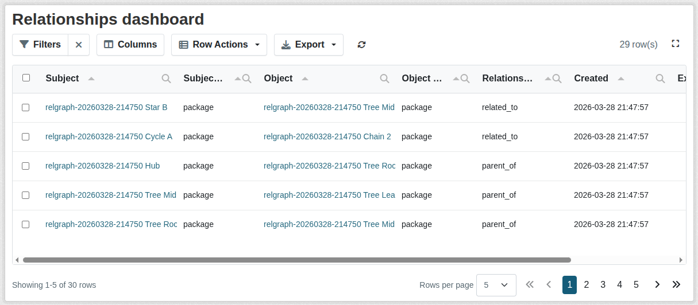

# Dashboard

The optional dashboard provides a sysadmin-only relationship browser built on
top of `ckanext-tables`.

## Enable the dashboard

Install the optional dependency:

```sh
pip install "ckanext-relationship[dashboard]"
```

Enable the plugins:

```ini
ckan.plugins = ... relationship tables relationship_dashboard ...
```

If you also use scheming-backed relationship fields, the full stack typically
looks like this:

```ini
ckan.plugins = ... scheming_datasets relationship tables relationship_dashboard ...
```

## Access and route

- URL: `/ckan-admin/relationships/dashboard`
- Access: sysadmin only
- A dashboard link is added for sysadmins in the CKAN interface

## What the table shows

Columns:

- Subject
- Subject type
- Object
- Object type
- Relationship type
- Created
- Extras

The Subject and Object columns are rendered as links to the corresponding CKAN
entity pages.

For UUID-backed relationships, those links resolve to the expected CKAN entity
pages. Legacy name-backed relationships can be ambiguous if different entity
types share the same name.

Each logical relationship appears once in the table.



## Actions

The dashboard supports:

- row deletion
- bulk deletion
- filtering
- sorting
- export through the standard `ckanext-tables` exporters

Large `extras` values are shown in a compact table-friendly format.

## Export behavior

Exports contain plain text labels rather than HTML links.
