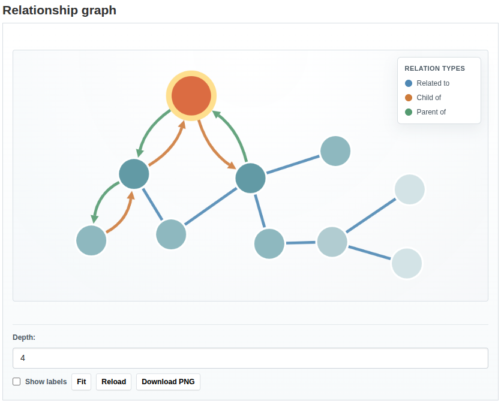

# Graph

The optional graph plugin provides a Cytoscape-based visualization of
relationships for datasets, groups, and organizations.

## Enable the graph plugin

Enable the base relationship plugin together with `relationship_graph`:

```ini
ckan.plugins = ... relationship relationship_graph scheming_datasets ...
```

If you want the graph snippet to appear on scheming dataset pages, keep
`relationship_graph` before `scheming_datasets` so its template override wins.

## Where it appears

When the plugin is enabled and the dataset type has relationship-backed fields,
the graph is rendered as a separate section on the dataset page.

It is not rendered inside the `additional_info` metadata table.

Automatic insertion on dataset read pages is controlled by
`ckanext.relationship.show_relationship_graph_on_read`, which defaults to
`true`.



## Graph snippet

The reusable snippet is:

### `relationship_graph/snippets/graph.html`

Use this snippet when you want to embed the graph manually in a custom template.

Example:

```jinja

```

Supported parameters:

- `object_id` (required)
- `object_entity` (default `package`)
- `object_type` (default `dataset`)
- `depth` (default `1`)
- `max_nodes` (default `100`)
- `relation_types` (optional list)
- `height` (default `500px`)
- `show_controls` (default `true`)
- `show_labels` (default `false`)
- `layout` (default `cose`)
- `include_unresolved` (default `true`)

## Visualization behavior

- `related_to` is rendered as a single undirected edge between two nodes
- `child_of` and `parent_of` are rendered as directed edges
- relation types are distinguished by color and shown in the legend
- relation labels are shown on hover, not as permanent edge text
- node labels can be toggled on and off
- the current dataset is visually highlighted

## Controls

When controls are enabled, the snippet provides:

- depth selection
- fit and reload actions
- PNG download of the current graph
- a label visibility toggle

## API

The plugin also registers:

- the `relationship_graph` action
- the `/api/2/util/relationships/graph` JSON endpoint

See [Actions and API](actions.md) for the full request and response contract.
